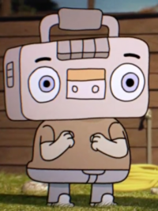
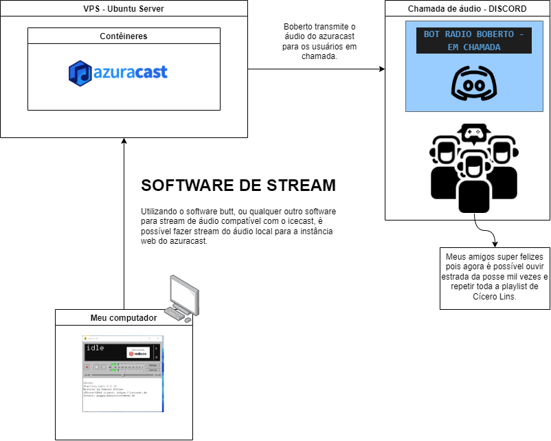

# discord-radio-bot

# EN
* This project is originally created by nthmost
* Check the original github page here: (Click here)[https://github.com/nthmost/discord-radio-bot]
* I used the original project to uses with my Virtual private server.

# PT/BR

* Este projeto foi originalmente criado por nthmost
Verifique a página original do github aqui: (Clique aqui) [https://github.com/nthmost/discord-radio-bot]
* Usei o projeto original para usar com meu servidor virtual privado.

# RADIO-JUKE-DISCORD

## História:

É impossível jogar paladins sem uma boa música de fundo. Como o discord removeu o bot que eu usava antes.. eu decidi fazer um stream de áudio.
Transmitindo o áudio do meu computador local para um servidor externo por stream. Assim eu consigo
expor o que estou ouvindo no spotify para os meus amigos durante a chamada no Discord.

## Fluxo:

